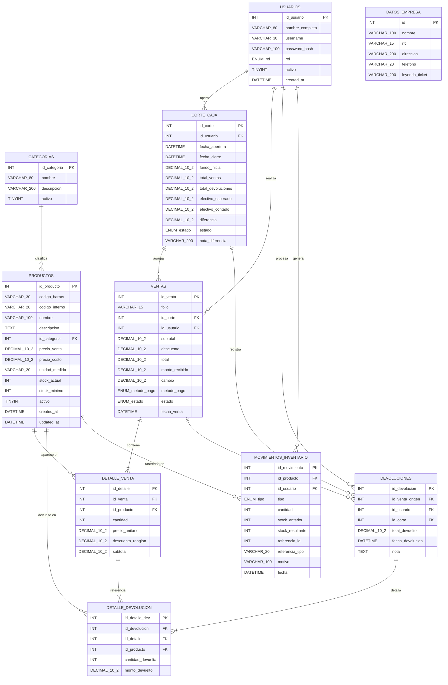

# Modelo de Datos — TPV Papelería

## Diagrama Entidad-Relación

---

## Notas del Modelo

### Decisiones de diseño

| Decisión | Justificación |
|---|---|
| `precio_unitario` en `detalle_venta` | Congela el precio al momento de la venta; cambios futuros no alteran tickets pasados (RN-04 del spec) |
| `estado` en `corte_caja` como ENUM | Solo dos valores posibles (`abierto`, `cerrado`); garantiza integridad a nivel de BD |
| `movimientos_inventario.referencia_id` + `referencia_tipo` | Patrón de referencia polimórfica: un movimiento puede originarse de una venta, devolución o ajuste manual |
| `detalle_devolucion.id_detalle FK` | Vincula la devolución al renglón exacto de la venta original para calcular correctamente el monto a reintegrar |
| `corte_caja` en `devoluciones` | Permite saber en qué turno se procesó la devolución, independientemente del turno de la venta original |
| Tabla `datos_empresa` con `CHECK (id = 1)` | Singleton de configuración; asegura un único registro sin lógica en aplicación |

### ENUMs definidos en el SQL

| Campo | Valores |
|---|---|
| `usuarios.rol` | `'administrador'`, `'cajero'` |
| `corte_caja.estado` | `'abierto'`, `'cerrado'` |
| `ventas.metodo_pago` | `'efectivo'` *(v1.0; tarjeta fuera de alcance)* |
| `ventas.estado` | `'completada'`, `'cancelada'`, `'devuelta_parcial'` |
| `movimientos_inventario.tipo` | `'venta'`, `'entrada'`, `'ajuste'`, `'devolucion'` |
